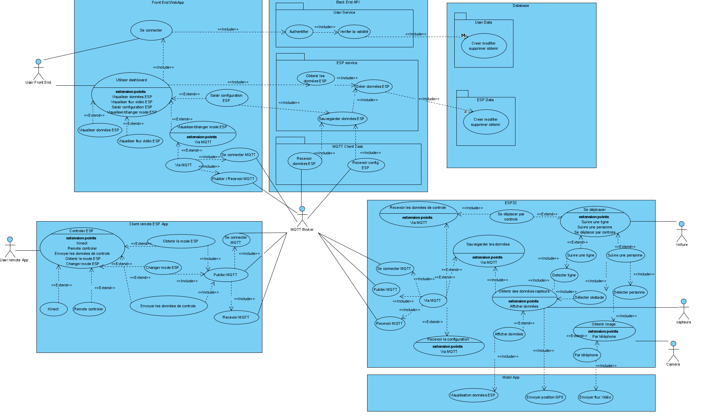

# Robot projet

**Participants du projet :**

- Belkarfa Lina
- Bouche Steven
- Garnier Corentin
- Griseri Pierre
- Parent Margaux
- Prevot Armand

# Description du projet

Création d'un robot piloter par ESP32, composé de différents capteurs lui permettant de se déplacer de façon autonome ou contrôlée et de renvoyer certaines données de son environnement. 

Le projet est dans le dossier Project.

## Matériels disponibles

- ESP32
- Joy_car de joy_it
- LED x6
- Speed sensor x2
- Ultrasonic sensor
- Linetracking sensor x3
- Obstacle sensor x2
- Servomotor x2
- Motor x2
- Battery case
- Photo sensor
- Teperature sensor
- Camera ESP32
- Kinect v1
- Manette

## Fonctionnalités du robot

### Modes de déplacement

- **Totalement autonome**
	- Suivi de personne via OpenCV
	- Suivi de ligne avec Linetracking et Ultrasonic sensor (dans un premier temps suivi d'un mur)
- **Totalement contrôlé**
	- Kinect
	- Manette

### Besoins pour les déplacements 

- **Totalement autonome via suivi de personne :**
	- Ultrasonic sensor pour détection obstacle 
	- OpenCV : bibliothèque de fonctions de programmation principalement destinées à la vision par ordinateur en temps réel
- **Totalement autonome via suivi de ligne :**
	- Ultrasonic sensor pour détection obstacle 
	- Linetracking sensor pour la détection de ligne

### Relevé des données de l'environnement

- Luminosité 
- Température
- Son ambiant si utilisation du téléphone
- Coordonnées GPS si utilisation du téléphone

### Visualisation temps réel de l'environnement

- Stream vidéo de la caméra
- Prise de photos
- Si possible à la fin enregistrement des flux vidéo ou photo

## Fonctionnalités applicatives 

- **Application client Web UI :** Angular / React
- **Application client lourd pour contrôle manuel du robot :** WPF
- **Application API :** ASP NET 5
- **Broker MQTT :** C#
- **Mobile App pour les données GPS ou utilisation mesure du son :** Xamarin ou Ionic
- **Database :** MongoDB

### Application client Web UI

- Switch entres les différents modes de déplacements du robot
- Visualisation des données de l'environnement
- Déclenchement de la prise d'une photo ou flux vidéo
- Visualisation du stream vidéo

### Application client lourd pour contrôle du robot 

- Switch entres les différents modes de déplacements du robot
- Contrôle du robot via Kinect
- Contrôle du robot via manette

### Application API

- Sauvegarde des données envoyé par le robot
- Obtenir les données pour l'affichage 

### Application mobile

- Envoyer les données GPS
- Envoyer les données des haut-parleurs
- Disponible Android et IOS

## Sécurité

- Login sur l'application Web
- OAuth avec JWT Token sur l'API
- MQTT avec TLS et authentification
- HTTPS

## Attribution des rôles

- Description fonctionnel / Gestion agile : **Prevot Armand**
	- Use cases
	- User story
	- Itérations

- Assemblage et interconnexion robot et ESP32 : **Belkarfa Lina** et **Griseri Pierre**

- Architecture / Conception et code :
	- User Interface : **Prevot Armand** et **Parent Margaux**
	- API backend / MQTT : **Bouche Steven**
	- Robot : **Belkarfa Lina** 
	- Client lourd de contrôle : **Garnier Corentin**
	- Mobile App : **Griseri Pierre**

- Qualité : **Garnier Corentin**
	 - Commentaire
	 - Documentation

- Déploiement / Mise en production / Sécurité : **Bouche Steven**

- Rapport : **Parent Margaux**

## Prévisionnel

Prévisionnel actuellement sur 3 itérations.

### Itération 1

- :heavy_check_mark: Assemblage du robot 
- :heavy_check_mark: Mise en place de la conception de l'architecture 
- :heavy_check_mark: Etude sur la connexion des capteurs du robot sur l'ESP32
- :heavy_check_mark: Ecriture des users story 
- :heavy_check_mark: Assemblage robot et ESP32
- :heavy_check_mark: Attribution des users story

### Itération 2

- :heavy_check_mark: Mise en place de la base de données 
- :heavy_check_mark: Mise en place du projet Web app UI
- :heavy_check_mark: Mise en place de l'API
- :heavy_check_mark: Mise en place du broker MQTT
- :heavy_check_mark: Mise en place de l'App de contrôle
- :heavy_check_mark: Mise en place projet ESP32
- :heavy_check_mark: Mise en place de l'app Mobile

### Itération 3

- :heavy_check_mark: Développement des modes de déplacements 
- :heavy_check_mark: Mise en place des endpoints API et sécurité
- :heavy_check_mark: Mise en place du dashboard sur la Web app UI
- :heavy_check_mark: Mise en place de la Kinect sur le client lourd 
- :heavy_check_mark: Mise en place des topic sur le borker MQTT
- :heavy_check_mark: Connexion de l'ESP32 avec le téléphone par bluetooh via l'application mobile

## Début de la conception du système : 

